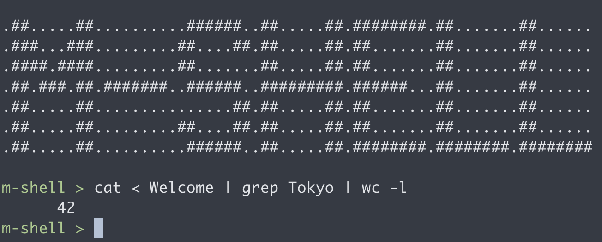

# MINISHELL


## Installation
Please clone this repository as follows

```
git clone https://github.com/madebypixel02/minishell.git
cd minishell
make
```
And if you start with debug mode, as follows.
```
make dev
./minishell_dev
```
With debug mode, you can check the process of lexer/parser/expander/executor.

## Document
https://tmuramat081.github.io/minishell_doc/

## Logs
- [使用可能関数](/assets/funcs.pdf)

- [抽象構文木](/assets/ast.pdf)

- [参考文献](/assets/ref.pdf)

- [Doxygenによる文書化](/assets/doxygen.pdf)

- [Gitの管理方法](/assets/git_manage.pdf)


## Thanks
Thanks for all the student, staff, sponser of 42 Tokyo!  
https://42tokyo.jp/

## Author 　
Mitsuru Matsuo (mmatsuo, 42 Tokyo).  
Taisei Muramatsu (tmuramat, 42 Tokyo). 


